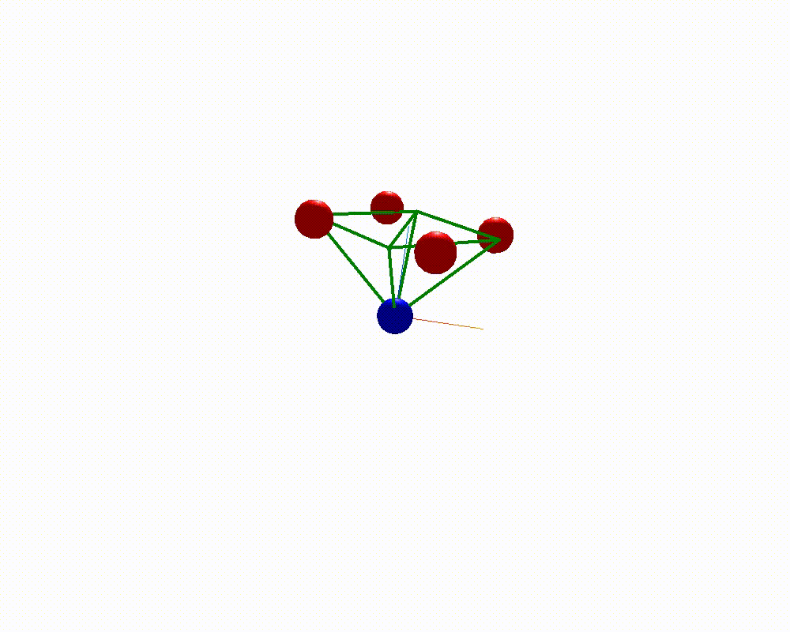

# Spinning top

A spinning top is modelled using 4 mass points and 1 fix point at the button. An initial velocity is applied to the 4 mass points to create a spinning motion.
All connections are length constraints.

